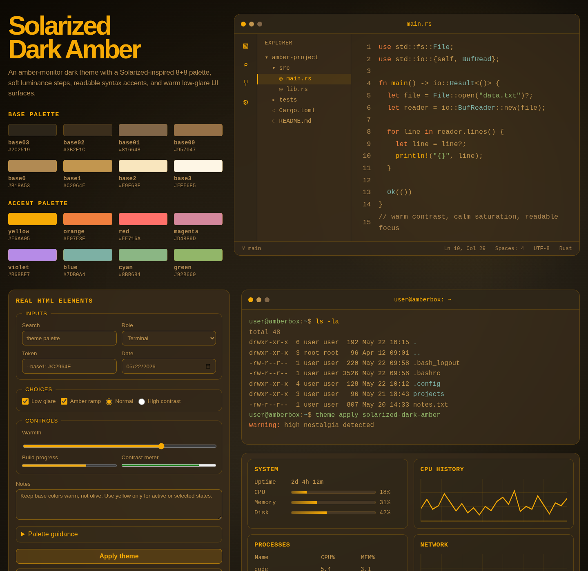

# Solarized Dark Amber

A warm, low-glare 16-color theme built on a Solarized-inspired CIELAB ramp with deliberate paired contrast.



## Palette

| Base | Hex | Accent | Hex |
| --- | --- | --- | --- |
| `base03` | `#312400` | `yellow` | `#F6AA05` |
| `base02` | `#3D2E0F` | `orange` | `#F07F3E` |
| `base01` | `#82672D` | `red` | `#FF716A` |
| `base00` | `#8F7339` | `magenta` | `#D4889D` |
| `base0` | `#B18B34` | `violet` | `#B68BE7` |
| `base1` | `#BF9841` | `blue` | `#7DB0A4` |
| `base2` | `#F1E8C9` | `cyan` | `#8BB684` |
| `base3` | `#FFF6D7` | `green` | `#92B669` |

Use `base03` for the background with `base0` text, and `base02` for raised or selected surfaces with `base1` text. Those pairs measure 4.78:1 and 4.90:1. Reserve `base2` and `base3` for inverse surfaces, `base00` for nonessential muted text, and `yellow` for focus or active states.

## Use

Use the CSS variables directly:

```html
<link rel="stylesheet" href="palette.css">
```

```css
body {
  color: var(--base0);
  background: var(--base03);
}
```

For tools and ports, consume [`palette.json`](palette.json), the canonical palette. After changing it, regenerate and verify the CSS:

```sh
node scripts/palette.mjs
node scripts/palette.mjs --check
```

Application ports:

- [Ptyxis palette](ports/solarized-dark-amber.palette): import with `ptyxis --import-palette ports/solarized-dark-amber.palette`, then select **Solarized Dark Amber** in your Ptyxis profile preferences.
- [Windows Terminal color scheme](ports/windows-terminal.json): add its object to the `schemes` array in your Windows Terminal settings.

Open [`index.html`](index.html) to view the full theme specimen. It is also ready to publish from the repository root with GitHub Pages.

## Credits

Inspired by [Solarized](https://github.com/altercation/solarized), created by Ethan Schoonover. Solarized Dark Amber is an independent adaptation and is not affiliated with the original project.

## License

[MIT](LICENSE). See [third-party notices](THIRD_PARTY_NOTICES.md) for Solarized attribution.
